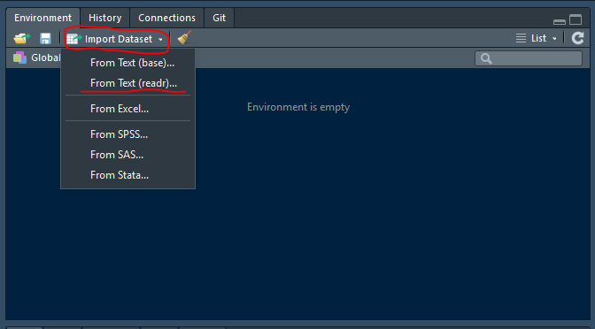
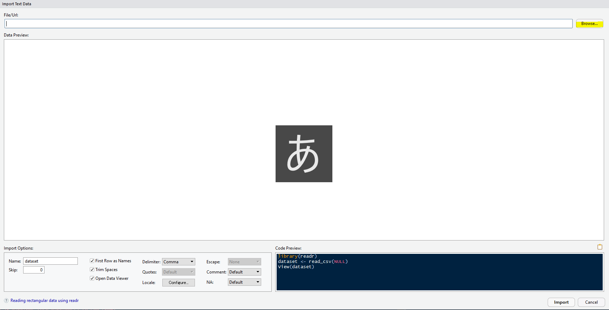
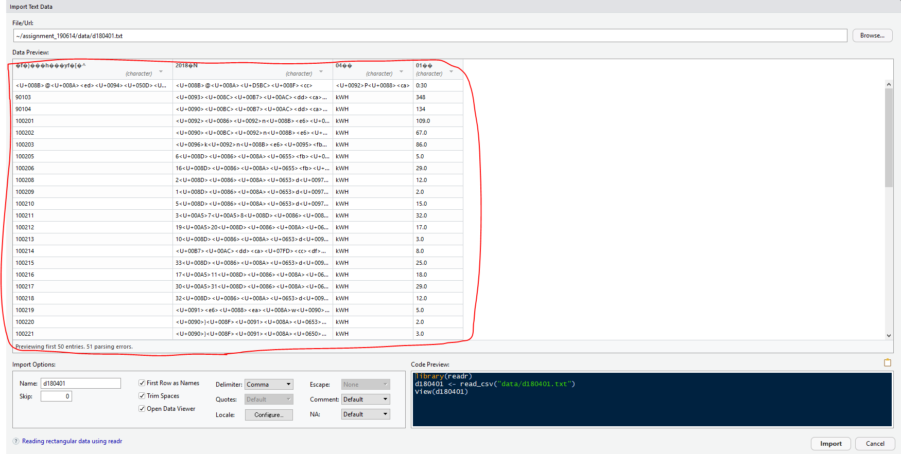
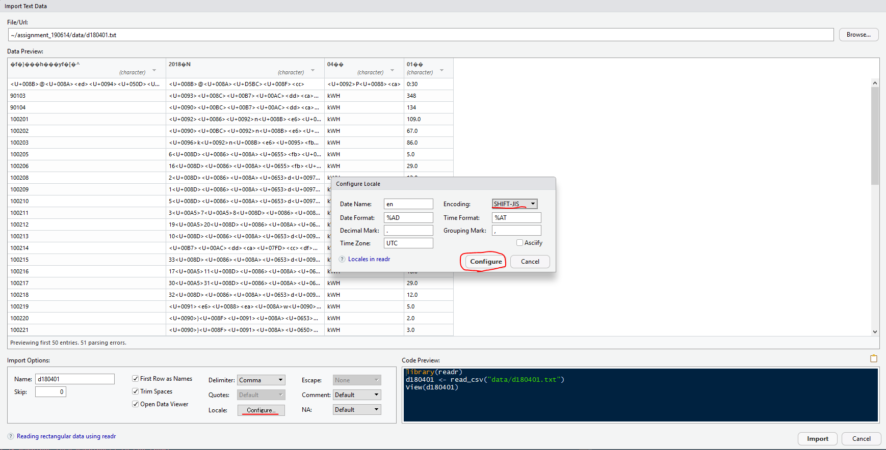
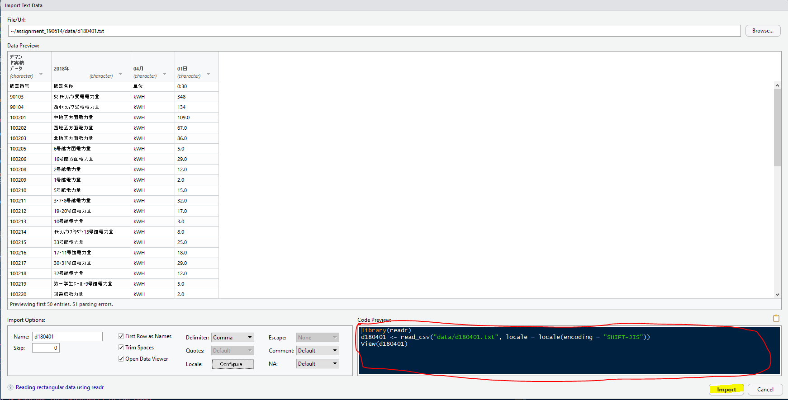
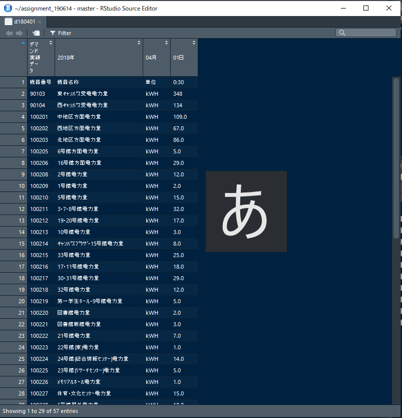
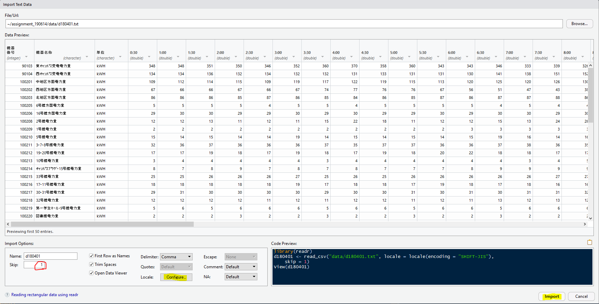
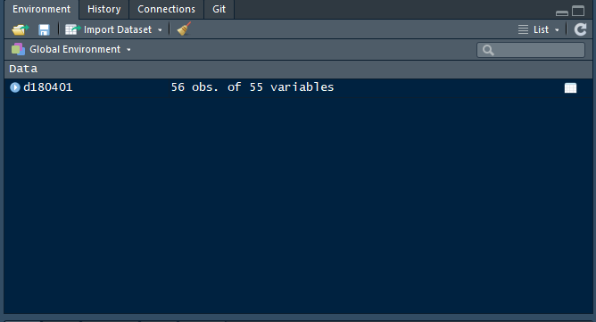
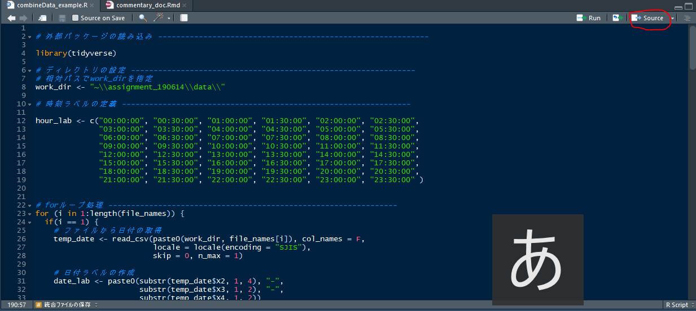
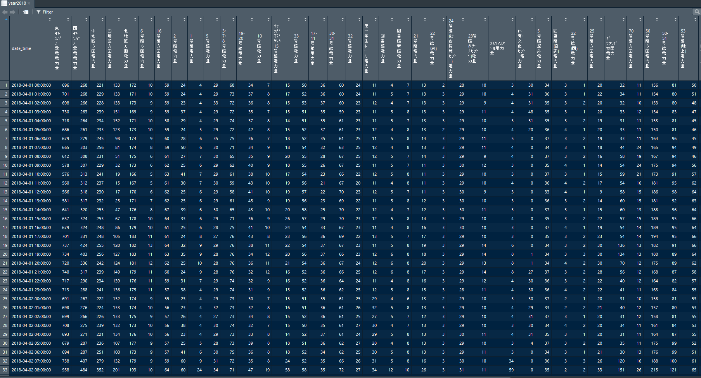

# 解説すること

この文書では、あるフォルダにある複数のデータファイル(csvファイルなど）を一つのファイルに統合して保存する方法を解説します。

# データの確認

RstudioにはUI（ユーザーインターフェース）でデータを確認する機能があるので、その機能を利用してみましょう。

まず右上のWorkspaceパネルにある*import Dataset*ボタンをクリックし、*From Text(readr)*の部分をクリックしてください。Rから`readr`パッケージをインストールするよう求められた場合は、Yesを選んでください。



すると、このような画面が立ち上がるので、*Browse*ボタンをクリックし、~/assignment_190614/dataにあるd180401.txtを開いてみてください。



d180401.txtのData Previewを確認すると、列名やその値が正確に読み込めていない（文字化けが生じている）ことが分かります。これは、文字符号化（エンコード）形式が誤っているためです。日本語のPC環境は主に*UTF-8*あるいは*Shift-JIS*が文字符号化形式が利用されているため、最低限この2種類は覚えておいてください。スマートBEMSから得られるデータの文字符号化形式は*Shift-JIS*です。 



文字符号化形式を変更するには、Locale:の*Configure...*ボタンをクリックし、ポップアップとして表示されるウィンドウのEncodingを*Shift-JIS*に変更し、ポップアップウィンドウ上の*Configure*をクリックしてください。



文字符号化形式を*Shift-JIS*に設定(configure)することで、Data Previewの文字化けが解消されます。そして、*Import*ボタンをクリックすることで、d18041というオブジェクト名のdata.frame型のデータとして対象とするcsvファイルを読み込むことができます。ちなみに、この作業はRのConsoleにCode Previewに表示されたコードを実行したことに過ぎません。但し、ファイルの中身がよく分からないときなどには、この*Import Dataset*のUIは便利な機能なので活用するようにしてください。



ただ、読み込んだオブジェクト`d180401`に違和感を覚えないでしょうか？



- あれ、時刻が0時半のデータしかないぞ？と思えた人はセンスがいいです。

Rで読み込むデータは列名に依存し、列名が無いと判断される場合、その下の行方向のデータは読み取られません。つまり、*0:30*を含む行を列名とする方が、良いと考えられるわけです。

では、もう一度*import Dataset*ボタンをクリックし、先程と同様な設定（文字符号化形式Shift-JIS)にしてください。そして、追加設定として*Skip*のテキストボックスの数字を0から1に変更し、再度*Import*ボタンを押してください。データの1行目を無視して、データが読み込まれます。




最終的にWorkspaceパネルに*d180401  56 Obs. of 55 variables*(56行55変数)と表示されていれば、大丈夫です。

# forループとif分岐のRでの書き方

プログラミングを少しかじったことがある人なら、forループやif分岐は使ったことがあると思います。そこで、ループ変数`i`が1~10の範囲(python等の0から始まるリストインデックスと異なり、1から始まるため）で、偶数か奇数かを判定するプログラムを考えてみようと思います。

```{r}
for (i in 1:10) {
  if(i%%2 == 0) { # iを2で割った時の剰余が0：偶数
    print(paste0(i, "は偶数です"))
  } else { # それ以外　iを2で割った時の剰余が０ではない：奇数
    print(paste0(i, "は奇数です"))
  }
}
```

上記のコードは、初歩的なforループの書き方です。例えば、`for (i in 1:10) {print("Hello")}`というコードであれば、10回コンソール上に"Hello"と改行入りで表示されます。forループ内でifと[比較演算子](http://cse.naro.affrc.go.jp/takezawa/r-tips/r/28.html)を用いた論理式を用いることで、偶数回目はAの命令、奇数回目はBの命令というように条件分岐させることができます(if分岐)。
なお、`paste0`関数は引数(arguments)として指定した文字列オブジェクトをスペースなしに連結することができる関数です。[計算演算子](http://cse.naro.affrc.go.jp/takezawa/r-tips/r/03.html)もできるだけ覚えるようにしてください。

# 目標とするyear2018.csvファイルの仕様について

1. 1列目に時刻日付ラベル（format:"%Y-%m-%d %H:%M:%S", tz:"UTC")、2列目以降は数値(numeric)型のデータが格納されたdata.frame

2. 行（下）方向に時が進む時系列データであり、時間間隔は1時間とする

3. 文字符号化形式UTF-8のcsvファイルとして保存する

作成するyear2018.csvファイルはこの仕様に従う必要があります。

# 具体的なRスクリプトファイル(.R拡張子)の書き方

## 外部パッケージの読み込み
```{r}
library(tidyverse)
```

Rパッケージの`tidyverse`はデータの加工に適した複数のパッケージを作業環境下に付与してくれるパッケージです。この場合、`ggplot2`や`dplyr`などの8種類のパッケージが作業環境下に付与され、`filter`関数(`dplyr`と`stats`)と`lag`関数(`dplyr`と`stats`)の関数名の干渉が起こっています。`tidyverse`パッケージは頻繁に利用するパッケージなので、使用したい外部パッケージが定まっていないときは、とりあえず読み込んでしまってもよいでしょうw

## 作業環境の設定

Rプログラムが実行されているフォルダのことをワーキング（カレント）ディレクトリと呼びます。まず、日毎のデータが保存してある*data*フォルダをワーキングディレクトリに設定しましょう。

```{r}
# ワーキングディレクトリを相対パスで指定
work_dir <- "~\\assignment_190614\\data\\"
# ワーキングディレクトリをwork_dirに設定
setwd(work_dir)
# ワーキングディレクトリの確認
getwd()
```

ワーキングディレクトリを確認するコマンド`getwd()`を実行し、"C:/Users/ユーザー名/Documents/assignment_190614/data"という文字列が返されれば、適切に設定ができています。

プログラマは、同様な単調な操作を書き下すことを嫌います。今回の課題はワーキングディレクトリ内のファイルに同様な処理を施していくことが予想されます。そのようなときに、forループを利用します。今回は`dir`関数を利用して、ワーキングディレクトリ内のファイル名をベクトル型で取得します。

```{r}
file_names <- dir(work_dir)
file_names
```
## 時刻ラベルの定義

時刻ラベルについては、例えば0時から0時半までに記録された電力積算値の時刻ラベルを"00:00:00"としてラベリングすることにします。データ分析においては、観測値の時刻ラベルが記録開始時刻なのか、記録終了時刻なのかという細かい点にも注意を払うようにしてください。今回は、記録開始時刻をラベリングするデータとします。30分間隔なので1日当たり48個の時刻ラベルが付与されることになります。

```{r}
# 時刻ラベルの定義
hour_lab <- c("00:00:00", "00:30:00", "01:00:00", "01:30:00", "02:00:00", "02:30:00",
              "03:00:00", "03:30:00", "04:00:00", "04:30:00", "05:00:00", "05:30:00", 
              "06:00:00", "06:30:00", "07:00:00", "07:30:00", "08:00:00", "08:30:00", 
              "09:00:00", "09:30:00", "10:00:00", "10:30:00", "11:00:00", "11:30:00", 
              "12:00:00", "12:30:00", "13:00:00", "13:30:00", "14:00:00", "14:30:00",
              "15:00:00", "15:30:00", "16:00:00", "16:30:00", "17:00:00", "17:30:00", 
              "18:00:00", "18:30:00", "19:00:00", "19:30:00", "20:00:00", "20:30:00", 
              "21:00:00", "21:30:00", "22:00:00", "22:30:00", "23:00:00", "23:30:00" )
```

## forループブロックの大枠

以下にforループブロックの大枠を示します。

```{r}
for (i in 1:length(file_names)) {
  
}
```

`length`関数をベクトルに適用することで、そのベクトル内にいくつの要素があるかが分かります。ベクトル型のオブジェクト`file_names`の範囲は1:10であるので10が返されます。従って、このforループはループ変数`i`が1ずつ増加（初回は除く）しながら、10回の処理を行うということです。

## i == 1(1回目の処理)について

```{r}
i <- 1
# ファイルから日付の取得
temp_date <- read_csv(paste0(work_dir, file_names[i]), col_names = F,
                      locale = locale(encoding = "SJIS"),
                      skip = 0, n_max = 1)
    
# 日付ラベルの作成
date_lab <- paste0(substr(temp_date$X2, 1, 4), "-", 
                   substr(temp_date$X3, 1, 2), "-",
                   substr(temp_date$X4, 1, 2))
    
# データを取得 
temp <- read_csv(paste0(work_dir, file_names[i]), 
                 locale = locale(encoding = "SJIS"), col_names = F,
                 skip = 2)
    
# 転置行列化, 最小値・最大値・平均値・合計値の項目を除く
# 要素化を防ぐため、数値データのみとする
t_temp <- as.data.frame(t(dplyr::select(temp, X4:X51)), row.names = F)
    
# 一日ごとの日付時刻ラベル作成
date_time <- paste(date_lab, hour_lab, sep = " ")
    
n_temp <- t_temp
n_lab <- date_time
```
1回目に定義したn_temp(各系列のデータ部分)とn_lab（日付時刻ラベル）を`rbind`関数を用いてデータ下部に結合させていきます。

## i > 1(else)の処理について

```{r}
i <- 2
# ファイルから日付の取得
temp_date <- read_csv(paste0(work_dir, file_names[i]), col_names = F,
                      locale = locale(encoding = "SJIS"),
                      skip = 0, n_max = 1)
    
# 日付ラベルの作成
date_lab <- paste0(substr(temp_date$X2, 1, 4), "-", 
                   substr(temp_date$X3, 1, 2), "-",
                   substr(temp_date$X4, 1, 2))
    
# データを取得 
temp <- read_csv(paste0(work_dir, file_names[i]), 
                 locale = locale(encoding = "SJIS"), col_names = F, skip = 2)
    
# 列名のための文字列を取得
cnames <- temp$X2
    
# 転置行列化, 最小値・最大値・平均値・合計値の項目を除く
# 要素化を防ぐため、数値データのみとする
t_temp <- as.data.frame(t(dplyr::select(temp, X4:X51)), row.names = F)
    
# 列名の追加
names(t_temp) <- cnames
names(n_temp) <- cnames
    
# 列名で整列させる(元データに余分な全角スペースが入っている)
c1 <- t_temp$`東ｷｬﾝﾊﾟｽ受電電力量　　　　　　　`
c2 <- t_temp$`西ｷｬﾝﾊﾟｽ受電電力量　　　　　　　`
c3 <- t_temp$`中地区方面電力量　　　　　　　　`
c4 <- t_temp$`西地区方面電力量　　　　　　　　`
c5 <- t_temp$`北地区方面電力量　　　　　　　　`
c6 <- t_temp$`6号館方面電力量 　　　　　　　　`
c7 <- t_temp$`16号館方面電力量　　　　　　　　`
c8 <- t_temp$`2号館電力量 　　　　　　　　　　`
c9 <- t_temp$`1号館電力量 　　　　　　　　　　`
c10 <- t_temp$`5号館電力量 　　　　　　　　　　`
c11 <- t_temp$`3･7･8号館電力量 　　　　　　　　`
c12 <- t_temp$`19･20号館電力量 　　　　　　　　`
c13 <- t_temp$`10号館電力量　　　　　　　　　　`
c14 <- t_temp$`ｷｬﾝﾊﾟｽﾌﾟﾗｻﾞ･15号館電力量　　　　`
c15 <- t_temp$`33号館電力量　　　　　　　　　　`
c16 <- t_temp$`17･11号館電力量 　　　　　　　　`
c17 <- t_temp$`30･31号館電力量 　　　　　　　　`
c18 <- t_temp$`32号館電力量　　　　　　　　　　`
c19 <- t_temp$`第一学生ﾎｰﾙ･9号館電力量 　　　　`
c20 <- t_temp$`図書館電力量　　　　　　　　　　`
c21 <- t_temp$`図書館新館電力量　　　　　　　　`
c22 <- t_temp$`21号館電力量　　　　　　　　　　`
c23 <- t_temp$`22号館(東)電力量　　　　　　　　`
c24 <- t_temp$`24号館(総合情報ｾﾝﾀｰ)電力量　　　`
c25 <- t_temp$`23号館(ﾘｻｰﾁｾﾝﾀｰ)電力量　　　　　`
c26 <- t_temp$`ﾒﾓﾘｱﾙﾎｰﾙ電力量　　　　　　　　　`
c27 <- t_temp$`体育･文化ｾﾝﾀｰ電力量 　　　　　　`
c28 <- t_temp$`5号館屋外電力量 　　　　　　　　`
c29 <- t_temp$`図書館(空調)電力量　　　　　　　`
c30 <- t_temp$`22号館(西)電力量　　　　　　　　`
c31 <- t_temp$`25号館方面電力量　　　　　　　　`
c32 <- t_temp$`ｸﾞﾗｳﾝﾄﾞ方面電力量 　　　　　　　`
c33 <- t_temp$`70号館方面電力量　　　　　　　　`
c34 <- t_temp$`50号館方面電力量　　　　　　　　`
c35 <- t_temp$`50･51号館電力量 　　　　　　　　`
c36 <- t_temp$`53号館(地上)電力量　　　　　　　`
c37 <- t_temp$`52号館電力量　　　　　　　　　　`
c38 <- t_temp$`ﾌﾛﾝﾃｨｱ研究棟電力量　　　　　　　`
c39 <- t_temp$`高電圧実験室電力量　　　　　　　`
c40 <- t_temp$`体育館電力量　　　　　　　　　　`
c41 <- t_temp$`ｸﾞﾗｳﾝﾄﾞ電力量 　　　　　　　　　`
c42 <- t_temp$`29号館(ｸﾗﾌﾞ･ｻｰｸﾙﾌﾟﾗｻﾞ)電力量　　`
c43 <- t_temp$`ﾃﾆｽｺｰﾄ電力量　　　　　　　　　　`
c44 <- t_temp$`53号館(屋上)電力量　　　　　　　`
c45 <- t_temp$`超伝導実験棟電力量　　　　　　　`
c46 <- t_temp$`72号館電力量　　　　　　　　　　`
c47 <- t_temp$`体育館(空調)電力量　　　　　　　`
c48 <- t_temp$`55号館電力量　　　　　　　　　　`
c49 <- t_temp$`70･71号館電力量 　　　　　　　　`
c50 <- t_temp$`武道体育館電力量　　　　　　　　`
c51 <- t_temp$`25号館電力量　　　　　　　　　　`
c52 <- t_temp$`14号館方面電力量　　　　　　　　`
c53 <- t_temp$`その他電力量　　　　　　　　　　`
c54 <- t_temp$`不言実行館電力量　　　　　　　　`
c55 <- t_temp$`外気温度　　　　　　　　　　　　`
c56 <- t_temp$`外気湿度　　　　　　　　　　　　`
    
# この順に強制的に並べ替え
t_temp2 <- cbind.data.frame(c1,c2,c3,c4,c5,c6,c7,c8,c9,c10,
                            c11,c12,c13,c14,c15,c16,c17,c18,c10,c20,
                            c21,c22,c23,c24,c25,c26,c27,c28,c29,c30,
                            c31,c32,c33,c34,c35,c36,c37,c38,c39,c40,
                            c41,c42,c43,c44,c45,c46,c47,c48,c49,c50,
                            c51,c52,c53,c54,c55,c56)
# 一日ごとの日付時刻ラベル作成
date_time <- paste0(date_lab, " ", hour_lab)
    
x_temp <- t_temp2
names(x_temp) <- cnames
# n_tempの更新
n_temp <- rbind(n_temp, x_temp)
x_lab <- date_time
# n_labの更新
n_lab <- cbind(n_lab, x_lab)
```
iが2以上(つまり、`else`のとき)は上記のコードの処理を行います。

## forループ後の処理について

forループ後は念のため、`work_dir`内のファイル数分ループするか判定(`judge`)を行います。

```{r}
# データ結合の判定
judge <- 
  if(i == length(file_names)) {
    print("結合成功")
  } else {
    print("結合失敗")
  }
```

この文書のように"結合失敗"と表示される場合は、forループがうまくいかなかった（ファイル数分ループしなかった）ということなので、forループブロック内のコードを見直す必要があります。

"結合成功"と表示される場合は、以下のコードをコピペすれば1時間間隔の指定した仕様のデータが完成するはずです。

```{r}
# 文字列の余分な全角スペースの削除
cnames2 <- gsub("　", "", cnames, fixed = T)

# 列名の追加
names(n_temp) <- cnames2
# 型を数値型(numeric)に統一
y <- n_temp %>% mutate_if(is.character, as.numeric)

# ラベルと結合
label <- c(n_lab)
dataset <- cbind(label, y) %>% as_data_frame()

# 1時間間隔のデータに変換
year2018 <- dataset %>% mutate(
  date_time = paste0(substr(label,1,14), "00:00")
) %>% 
  group_by(date_time) %>% 
  select(-label) %>% 
  summarise_each(funs(sum))
```

## データの保存

最後にデータの保存です。文字符号化形式UTF-8のcsvファイルとして保存できる`write_excel_csv`という便利な関数があるので、この関数を用いて`year2018`オブジェクトを'year2018.csv'として保存してください。

```{r}
# save用のディレクトリ
save_dir <- "~\\assignment_190614\\"
# UTF-8のcsvファイルとして保存（ここでは実行しない）
# write_excel_csv(year2018, file.path(save_dir, "year2018.csv"))
```
# 最後に

ここまでの内容をまとめたR Scriptファイル(combineData_example.R)を作成してあるので、各自のPC環境でその挙動を確かめてみてください。R Scriptの実行は、RStudioのSource editer右上部の*Source*ボタンをクリックするだけです。下の2番目の図のようなデータセットが出来上がるはずです。




最後らへんに大幅に解説をすっ飛ばした部分もありますが、以上で「10個のデータファイルを1ファイルに統合する方法 by R」の解説を終わります。

R言語に限らずプログラミングにおいて、予期せぬエラーが生じることは日常茶飯事です。分からないことがあれば、気軽に佐橋に相談してください！